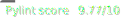

# Mastermind Capstone Project  

## Project Overview

**Project Owner**: [Christian Hodges](https://github.com/chodges7) 

**Project Title**: Mastermind

**Project Requirements**: 

- Docker
- See [requirements.txt](./mastermind_django_files/requirements.txt) for installed packages

**Project Description**: This project is a version of the popular code-breaking game Mastermind from the 1970s. Mastermind is a logic puzzle game that tests the player's ability to find the correct permutation of the specified objects. The objects that I want to use in my online game are letters and words. A similar application to my project is [Wordle](https://www.powerlanguage.co.uk/wordle/). Though, I want to improve on Wordle. In Wordle, a player can only play once a day and the correct word is always the same no matter who is playing on that specific day. This is both a pro and a con for Wordle since it allows players to brag about getting the same word before another person, but it means that it limits the amount of playtime to around 10 minutes per day. I want to solve this problem by allowing my game to run as a time trial version of Wordle. This would keep the advantage of allowing players to brag about their top score since they would be able to share how many words they could guess in a set amount of time, and it would eliminate the con of limiting gameplay because players would play until they wanted to stop. The word that the player is guessing would not be limited to once a day. One last thing to mention is that there is a service called [Wordle Unlimited](https://www.wordleunlimited.com/) which creates Wordle after Wordle without having to wait another day, but I think this is actually a con for the service because it doesn’t provide another way of encouraging players to share their scores or provide more challenge. The reason many people come back to Wordle day after day is that they can share about it since it is the same word for everyone.

**Platform**: A web-based application hosted on AWS, using Bootstrap, Django, and p5.js.

**Outline**:

- *Main page*: the main homepage of the application will have a short description talking about what the game is and how to play it. There will also be a “play” button to start the game.
	- *“Play” button*: the play button will link to the game page that starts a countdown and has the javascript game. 
- *Game page*: the game page will simply have the game running and allow the player to interact with the game.
	- *Timer*: The game will have a timer counting down with how much time is left. There will also probably be a line from green to red which moves based on how much time is left like a health bar.
	- *Points*: There will be a point system based on how many words that the player has guessed in the current game.
	- *High score*: There will also be a high score for the game. Before implementing Accounts the high score will be a world record of sorts and after the accounts feature is implemented it will have an all-time high score for the player.
	- *Game*: the game will be a matrix composed of a 5x6 grid. There will be 4 columns for each letter in the word and 6 rows for the 6 guesses the player can make. After the player guesses a word, they will then turn black for if that letter is not in the word, yellow if it’s in the word, but it’s not in the right spot, and green if the chosen letter is in the word and in the correct spot.
- *Info page*: The info page will be a more detailed list of instructions for the player who might want to know more about the game, where it came from, and have some gifs of what the game looks like.
- *Login*: A login page to allow logging into your account
- *Logout*: A logout page to allow logging out of your account
- *Signup*: A register page to allow registering of an account
- *Stats*: The account page will show the lifetime stats of your account so that one can share multiple attempts of gameplay or show how often they can guess a word in general instead of just their previous attempt. Their account could also have achievements like how many attempts they’ve played or how many words in one attempt.
	- The login, logout, register, and account pages are all stretch goals if time allows since I want to get the game working before I start on lifetime achievements/statistics.
