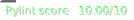

# Mastermind Capstone [](https://github.com/chodges7/mastermind-capstone/actions/workflows/docker-build.yaml) [](https://github.com/chodges7/mastermind-capstone/actions/workflows/pylint.yaml)

## Senior Project Poster


## Setup

### Required Tools
1. Docker
2. Git

### Local Dev
1. Clone the repo with the following command:
    ```bash
    git clone https://github.com/chodges7/mastermind-capstone.git
    ```

2. Create a `.env` file for the Django `SECRET_KEY` env variable
    ```
    SECRET_KEY=1a2b3c4d...
    ```
    - A secret key generator can be found [here](https://miniwebtool.com/django-secret-key-generator/).

3. Run Docker compose with the following command:
    ```bash
    docker compose up -d
    docker compose log -f
    ```
    > Note: The `docker-compose.yaml` file points at this github repo's container registry. You might want to change to a local build or your own fork's GitHub package.

4. The Django project should now be availible on http://localhost:80
